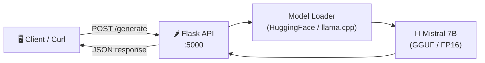

# Flask + Mistral 7B MLOps Example

<p align="center">
  
  
  
  
  
  
</p>

A minimal **Flask REST API wrapper around Mistral 7B** for local LLM inference. Demonstrates MLOps best practices: containerized serving, health checks, and structured request/response schemas.

---

## 🏗️ Architecture



---

## 🚀 Quick Start

### Local (CPU)
```bash
pip install -r requirements.txt
python app.py
```

### Docker
```bash
docker build -t flask-mistral .
docker run -p 5000:5000 -v ./models:/models flask-mistral
```

---

## 📡 API Usage

### `POST /generate`
```json
{
  "prompt": "Explain transformers in one paragraph",
  "max_tokens": 256,
  "temperature": 0.7
}
```

**Response:**
```json
{
  "generated_text": "Transformers are neural network architectures...",
  "model": "mistral-7b",
  "tokens_used": 187,
  "latency_ms": 3420
}
```

### `GET /health`
```json
{ "status": "ok", "model_loaded": true }
```

---

## ⚙️ Configuration

```env
MODEL_PATH=./models/mistral-7b-instruct-v0.2.Q4_K_M.gguf
MAX_CONTEXT_LENGTH=4096
N_GPU_LAYERS=0    # Set > 0 if CUDA available
```

---

## 📄 License

MIT
